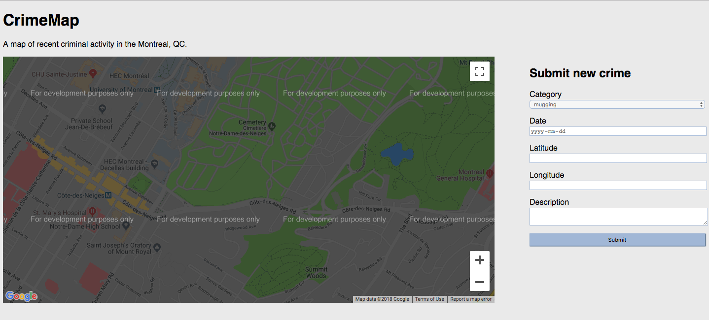

# [Crime-Map](https://crimemap-vb.herokuapp.com/)
# Crime-Map Web App
<table>
<tr>
<td>
  A webapp showcasing the implementation of the main components for a Flask application while integrating and interacting with the Google Maps API.
</td>
</tr>
</table>

## Hosted 

- [Heroku](https://www.heroku.com/about) - Heroku is a container-based cloud Platform as a Service (PaaS).

- Check the [crimemap-production](https://crimemap-vb.herokuapp.com/) instance;

- !!! No split of this project in dev, staging, production since the limit for free web apps, hosted on Heroku (for free), is very small [hey, give me some money and I'll apply the full dev-cycle ;) ]

### Landing Page

### [Development](https://github.com/vBarbaros/crimemap/blob/dev/CONTRIBUTING.md)
Want to contribute? Great!

To fix a bug or enhance an existing module, follow these steps:

- Fork the repo
- Create a new branch (`git checkout -b improve-feature`)
- Make the appropriate changes in the files
- Add changes to reflect the changes made
- Commit your changes (`git commit -am 'Improve feature'`)
- Push to the branch (`git push origin improve-feature`)
- Create a Pull Request 

### Bug / Feature Request

If you find a bug kindly open an issue [here](https://github.com/vBarbaros/crimemap/issues/new) by including the steps to reproduce it.

If you'd like to request a new function, feel free to do so by opening an issue [here](https://github.com/vBarbaros/crimemap/issues/new).

## Built with 

- [Flask](http://flask.pocoo.org/docs/1.0/) - Flask is a microframework for Python based on Werkzeug, Jinja 2 and good intentions. And before you ask: It's BSD licensed!.

- [Google Maps Platform](https://cloud.google.com/maps-platform/maps/) - Welcome to Google Maps Platform. Explore where real-world insights and immersive location experiences can take your business.

## Credits

- The Book [Flask: Building Python Web ServicesGareth Dwyer, Shalabh Aggarwal, Jack Stouffer](https://www.packtpub.com/web-development/flask-building-python-web-services) While using the tutorials described in this book, I made the following improvement:
	1) adapted the overall architecture of the current Flask webapp to a more reusable one;
	2) adapted the app to use the free version of the Google Maps API;
	3) added a mock-database, to make it usable and deployable on Heroku;
	4) prepared the necesary files to make it deployable to Heroku in seconds!!!

## To-do
- Add Unit Tests;
- Add CI using Travis CI;
- Improve upon app's architecture, using templates and styling;
- Integrate the app with a real MySQL DataBase, directly on Heroku;
- (...to be added, there is always stuff that can be added);

## [License](https://github.com/vBarbaros/crimemap/blob/dev/LICENSE)

MIT © [Victor Barbaros](https://github.com/vBarbaros)
